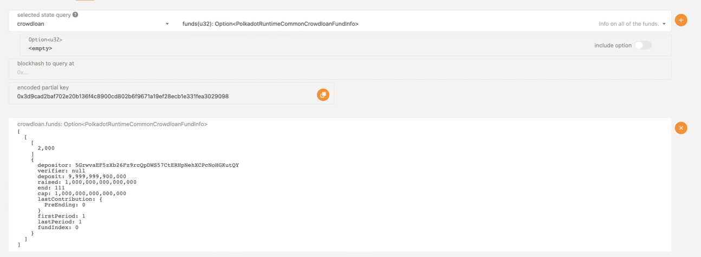

# Guide on creating a local crowdloan

### Step 1

Build polkadot node **WITH THE FAST-RUNTIME FEATURE**: `cargo b -r -p polkadot --features fast-runtime`

### Step 2

Build `adder-collator` node: `cargo b -r -p test-parachain-adder-collator`

### Step 3

Ensure your binaries lie in the correct dir:
`ls target/release | grep polkadot`, `ls target/release | grep adder-collator`

Install zombienet for your OS from here: https://github.com/paritytech/zombienet
Move the zombienet binary (macOS or Linux) to **this** directory (project root of `polkadot`).

Start the network with the following command (we use the native OS as the host for the network):
`./zombienet-(macos|linux) -p native spawn zombienet_tests/smoke/0001-parachains-smoke-test.toml`

### Step 4 - network prep

Open `alice` node interface with the generated link like this:

Navigate to Network > Parachains > Parathreads tab:

Click the `+` button on `+ParaId`, register the ParaId with Alice (you will have 2000 as the default ParaId)
After that, go to Developer > Extrinsics > registrar > register extrinsic,
input your ParaId (2000), after that open your `wbuild` dir in `target/release` to see WASM binaries.
Toggle "upload file" switch for `validatonCode`, upload your `test_parachain_adder.wasm` WASM (it's the bottom one here):

To find the data for the second parameter, go to your zombienet logs and find logs
about genesis state and genesis wasm:

Navigate to the directory where the **genesis-state** was exported:

After that, read file contents and copy them. This will be your second parameter.

In the end, your extrinsic has to look somewhat like this:

### Step 5 - auction and crowdloan

After your parathread is registered, start an auction period like this:

Then go to the Network > Parachains > Crowdloan tab and click `Add fund`:

After the creation of crowdloan is successful, you can contribute to it, by, let's say, Bob.

This is how Bob's contribution will look:

Then you can get the crowdloan data here:
